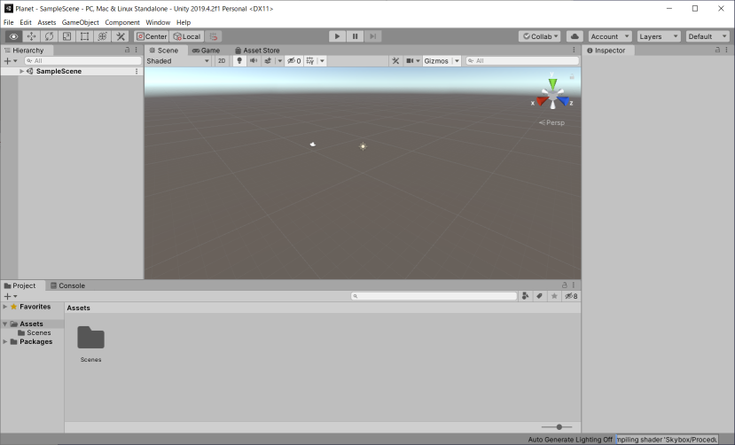
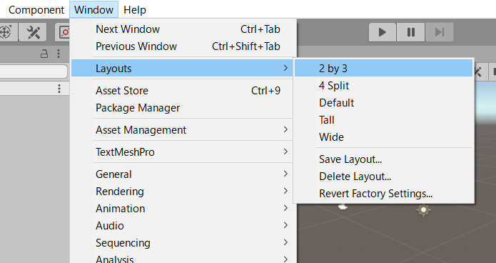

# はじめに

## このチュートリアルの目的

　本テキストは、デザイナー、アーティスト、研究者といった非プログラマーの人が無理なくUnityの基本を身につけられるように作成しました。一般的なUnityのチュートリアルは簡単なゲームを1本作りきるスタイルが多いですが、非プログラマーが最初に触れるテキストとしては覚える内容とコーディング量が多くなってしまいます。

　このチュートリアルでは全機能を網羅的に学ぶのではなく、まずは簡単な物体の動かし方と見た目の演出方法を学習し、動く絵（シーン）を比較的自由に作れるようになることを目指しました。プログラムは20～40行程度として、C#プログラミングの深い知識がなくても理解できる内容にしています。また、Unity内だけで完結するように、別のツールで作成したモデルを極力使用せずUnityで生成できる基本オブジェクトやAsset Storeの無料素材を利用するようにしています。

　3つのチュートリアルはそれぞれ独立していますが、前のチュートリアルで解説した知識が前提になっているので順番におこなうことをお勧めします。

### チュートリアル１　Planet
- 物体の移動と回転
- 基本的なマテリアルとテクスチャ
- カメラと光の演出
- アセットストアとの付き合い方
- ポストプロセッシングで絵作りその１

  
https://www.youtube.com/watch?v=MLqGxgJo3tg

### チュートリアル２　Penguin
- Unityだけで簡易的なモデルの作成
- 水の表現
- ターゲットの方向を向く処理
- さまざまな動きのアルゴリズム

  
https://www.youtube.com/watch?v=AcOAPCGrMmQ

### チュートリアル３　TrenchFighter
- プロシージャルなステージ生成
- 簡単なサウンドの使い方
- 物理演算を使わない衝突判定
- 入力の処理
- ポストプロセッシングで絵作りその２

  
https://www.youtube.com/watch?v=0RFQhiBr58c

## ここでは学ばないこと

　本テキストでは、次の項目には触れていません。チュートリアルを終えてUnityの概要を理解したのちに、自分に必要な項目を選択的に学ぶことをお勧めします。

- C#プログラミング技術
- 3D数学の詳細（ベクトル、クォータニオン、行列）
- 物理演算
- 本格的なモデル作成
- モデルアニメーション
- ゲーム中のシーン切り替え演出
- 2DのUI（Canvas）
- Terrainによる地形作成
- パーティクルによる演出
- 各種レンダラー詳細
- マテリアルとシェーダーの詳細
- レベルデザイン、おもしろさの演出
- ゲームAI
- チーム開発

## Unityについて
　このチュートリアルではUnity自体のインストール方法や網羅的な操作説明はおこないません。次の公式マニュアルを参照してください。

https://docs.unity3d.com/ja/current/Manual/UsingTheEditor.html

　チュートリアルを進めるうえでは、最低限Sceneビューの次の操作だけ覚えてください。それぞれ複数の操作方法があるので併記しています。

#### 視点ズーム　
* ホイール回転
* トラックパッドを二本指で前後に動かす

#### 視点回転　
* 右ボタンドラッグ
* Alt（Macではoption）+左ボタンドラッグ
* トラックパッドを二本指で横ドラッグ

#### 視点平行移動
* ホイールボタンドラッグ
* 手のひらアイコンを選択して左ボタンドラッグ

　また、Hierarchyでオブジェクトをダブルクリックするとそのオブジェクトが画面の中心にきてズームされるので、Sceneビュー上でオブジェクトを見つけられないときなどに便利です。

#### オブジェクトの移動
* 十字矢印アイコンを選択、フォーカス中のオブジェクトが左ボタンドラッグで移動可能になる

　移動はInspectorのTransform　Positionでも可能です。数値指定で正確な位置に移動させる場合はこちらを使用します。

#### レイアウト
　Unityの画面レイアウトは熟練者でも好みが分かれる点で、Defaultか2 by 3を使う人が多いようです。このチュートリアルではシーンビューとゲームビューが同時に表示されて状況が確認しやすいため2 by 3レイアウトで説明します。

Defaultレイアウト  

2 by 3レイアウト  

　レイアウトは、Window→Layoutsメニューからいつでも変更できます。

## 開発言語
　UnityではC#言語を使って開発します。もともとJavaScriptやBooといったほかの言語も使えましたが、バージョンアップにつれてC#に統一されました。

　C#は、Unityのように多くのソースファイルを行き来する場合でも型が明確で理解しやすい言語です。一方でC++のような職人的なメモリ管理を自前ですることなく扱えるため、初心者にもやさしい言語になっています。

## テキストエディタ
　テキストエディタは[Visual Studio Community（個人向け無償）](https://www.microsoft.com/ja-jp/dev/default.aspx)を推奨します。

　ゲーム開発では、多くのAPIやオブジェクトを利用するので、インテリセンスの入力支援機能が効率的な開発には必須になります。オールインワンのIDEよりもテキストエディタの軽さを重視する人にはVisual Studio Code( https://code.visualstudio.com/ )も人気があります。この場合、C#プラグイン、Debugger for Unityプラグインを導入してください。有償も含めるとRider( https://www.jetbrains.com )などもよいという話は聞きます。いずれにしても単なるエディタではなく、API名の入力補完やクラス構造の探索機能が充実しているものを使用するようにしてください。

注　Visual Studio for Macは、以前は「\_」（アンダースコア）が入力できなかったり、最新版でも日本語入力が若干見づらいという欠点があるようです。ただ、それを差し引いてもVisual Studio for Macを使うようにしてください。

　UnityからVisual Studio for Macを起動できるように、次の手順で外部ツールを登録します。

* Editメニュー（MacはUnityメニュー）→Preference→External Tools→External Script Editorで「Visual Studio」を選択。使用したいエディタが表示されない場合は「Browse...」から実行ファイルを選択してください。

[チュートリアル１「Planet」へ進む](2_planet.html)

 
