# チュートリアル１「Planet」

## このチュートリアルについて

　最初のチュートリアルです。球形のモデルだけを使用して宇宙空間の表現を学んでいきます。

* 物体の移動と回転
* 基本的なマテリアルとテクスチャ
* 基本的なカメラと光の演出
* アセットストアとの付き合い方
* ポストプロセッシングで絵作りその１

[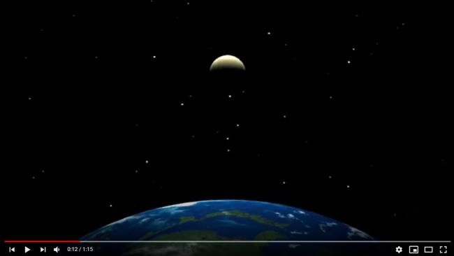](https://www.youtube.com/watch?v=MLqGxgJo3tg)  
https://www.youtube.com/watch?v=MLqGxgJo3tg


 ## オブジェクトの基本操作
　「Planet」の名前で新規プロジェクトを作ってください。テンプレートは3Dを選択します。

　プロジェクト作成直後はサンプルシーンが開いている状態ですので、File→New Sceneを選んであらたなシーンを作ります。

　まず、シーンに球体（Sphere）を生成します。Hierarchyで何も選択されていないことを確認します（重要）。Hierarchyウィンドウの空き領域を右クリック（トラックパッドでは二本指クリック）してコンテキストメニューから3D Object→Sphereを選びます。（GameObjectメニューやツールバーのCreateからも生成できますがコンテキストメニューからが早くて楽です）
 
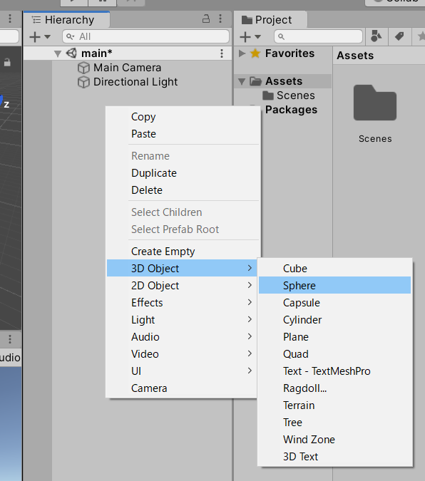

 
　生成したSphereをHierarchyで選択して、InspectorのPositionを```0,0,0```、Scaleを```3,3,3```に変更します。これで座標```(0,0,0)```に直径3の球体が作成できました。
 
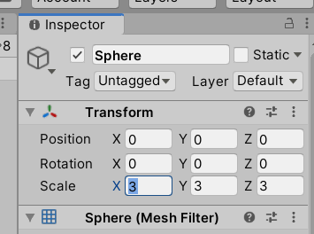

 
　同じようにもうひとつ球体を生成します。今度はPositionを```10,0,0```、Scaleを```1,1,1```にします。これで地球と月の原型ができました。わかりやすいようにそれぞれEarth、Moonと名前を変更しておきましょう。名前の変更は、Hierarchyでオブジェクトが選択されている状態でもう１回クリックするか、Inspectorの一番上の文字列を変更します。
 


 
　ここまで終わったら、Ctrl+Sでいったんシーンをセーブしておきましょう。名前はなんでもよいですが、お勧めは「main」です。Scenesというシーン保存用フォルダが用意されているのでその中に保存するとわかりやすいでしょう。Unityはセーブの概念がシーン単位のため慣れないうちは注意が必要です。Hierarchy上の変更は原則としてセーブしないと失われるのでこまめにセーブするようにしましょう。

## マテリアルの作成
　このままではまだ色が月や地球に見えないのでマテリアルを新規作成して設定します。

　ProjectウィンドウでAssetsを選択し、次にAssetsペインで右クリックメニュー→Create→Materialを選択します。マテリアル名は「matMoon」としておきます。Unityは拡張子が表示されないので、接頭子として種別をつけておくと便利です。
 


 
　matMoonを選択してInspectorでマテリアルの設定をしていきます。たくさんパラメータがありますが、最初はAlbedoで色またはテクスチャを指定、MetallicとSmoothnessで質感を指定、必要であればEmissionで光らせる、くらい覚えておけば十分です。

matMoon

　Albedo： R:233, G:230, B:160, A:255  
　Metallic：0.36  
　Smoothness：0  

にします。

　マテリアルをHierarchyのMoonの上にドラッグ&ドロップすると適用されて、Sceneビューの色が変わります。
 
注　マテリアルをInspectorで変更した場合、例外的にセーブ操作をしなくても変更が永続的に残ります。シーンを保存せずに破棄してもマテリアルの変更は破棄されないので注意してください。

 
## テクスチャの作成
　次に地球にテクスチャを適用して陸地を作ってみましょう。サイズは512×512など縦横同じ2のn乗ピクセルにしたpngファイル、こんな雑な感じで大丈夫です。本テキストをWebで見ている場合、この画像を右クリックして保存すればそのままテクスチャ用画像として使用できます。
 


 
　pngファイルをProjectウィンドウのAssetsペインにドラッグ&ドロップしたらアセットとして取り込まれます。

　テクスチャはそのままではモデルに貼れず、いったんマテリアルにする必要があります。あらたにmatEarthマテリアルを作成し、Albedoの左側の正方形にドラッグ&ドロップするか、その隣の小さな円をクリックしてテクスチャ画像を選択します。

matEarth

　Albedo： 地球テクスチャを選択　R:255, G:255, B:255, A:255  
　Metallic：0.285  
　Smoothness：0.47

　マテリアルをHierarchyのEarthの上にドラッグ&ドロップすると適用されます。

 
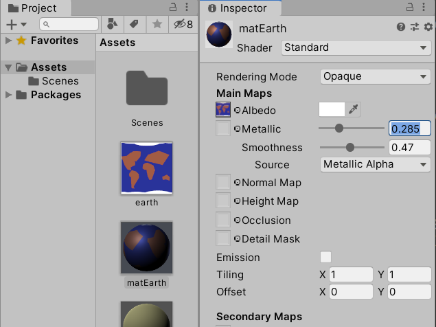

 
## カメラと光の演出
　Unityで光を表現するためには次の設定をする必要があります。

* Directional Light　降り注ぐ光
* Environment Light　環境光
* Skybox　空や地面などすべての遠景

　また、シーンに発光する物体がある場合、上記に加えて次の設定をおこないます。

* マテリアルのEmission　マテリアル本体の明るさ
* Point Light　発光物近辺のオブジェクトへの影響
* Bloom　発光物近辺の空気への影響

　これらの各種光の設定が、それぞれ別の画面にあるところがUnityのわかりにくところでもあります。一度慣れてしまえば効率よく作業できるので、頑張って操作を覚えましょう。
 
### Directional Light　降り注ぐ光
　Directional Lightはデフォルトで配置されています。通常はInspectorでRotation、Color、Intensityを調整するくらいです。今回はあとで太陽と差し替えるということもあり、そのままにしておきます。

### Environment Light　環境光
　今回は舞台が宇宙であり、光のあたらないところは真っ暗にしたいので環境光を暗くします。

　Windowメニュー→Rendering→Lighting Settingsでダイアログを開きます。

　上段のボタンで「Scene」が選択されていなければ選択してください。

　Environment Lightingで、SourceをColor、Ambient ColorをR:0,B:0,G:0に設定します。
 


 

### Skybox
　Skyboxの設定はカメラのInspectorにあります。Main Cameraを選択してInspectorで、Clear FlagsをSolid Color、BackgroundをR:0,G:0,B:0に設定します。

　ついでに、そのままだと月がちょっと見づらい位置にあるので、Main CameraのPositionを5,1,-10に変更します。

　Sceneビューはそのままですが、Gameビューの背景色が変わります。
 
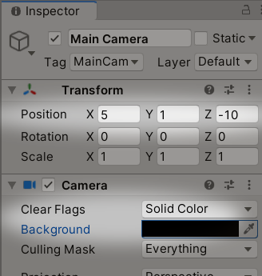

 


 
## オブジェクトの回転
### 自転
　次に、スクリプトを書いて地球を自転させましょう。

　HierarchyでEarthを選択してInspectorの最下段のAdd Componentボタンを押します。New Scriptを選択してスクリプトを生成します。スクリプト名は任意ですが、ここでは「Spinner」としておきます。


Spinner.cs
```cs
using UnityEngine;

public class Spinner : MonoBehaviour {

    float angle = 0;

    void Start () {
        
    }
    
    void Update () {
        angle = Time.deltaTime * 360;
        transform.Rotate(Vector3.up, -angle);
    }
}
```
 
　Update関数で毎フレーム角度を計算して、このスクリプトがアタッチされたオブジェクトを回転します。
```
angle = Time.deltaTime * 360;
```  
で角度を計算しています。Unityで移動や回転のスクリプトを書くときは、必ずTime.deltaTimeを使って速度を決めるようにしてください。これは1フレーム分の時間が格納されている変数で、たとえば30fpsの場合は、1÷30 = 0.03333……というような値が入っています。この値を毎回使うことで、CPUの遅いマシンや、重い処理でフレームレートが十分出ないときでも一定の速度で動かすことができます。逆にこの値を使わないと、高速なPCで実行したときに速すぎてゲームにならないこともあります。

　ここでは、Time.deltaTimeに360（度）をかけているので、1秒あたり1回転することになります。つまり現実の1秒がこの宇宙での1日を表しています。

　Rotate関数のVector3.upは真上に向いたベクトルで、回転運動の軸がy軸であることを指定しています。```new Vector3(0,1,0)```と書いても同じです。

　-angleのようにマイナス符号をつけると反時計方向の回転となります。
 
### 実行確認
　ここでスタートボタンを押して実行してみましょう。地球が1秒間に1回まわっていれば成功です。

　実行にあたりお勧めの機能があります。GameビューのMaximize On Playをクリックしておくと実行したときUnityエディタのサイズいっぱいに表示するので見やすくなります。もう一度クリックするとGameビューのサイズのまま実行するため、今度は動いている最中のHierarchyの状態を確認しやすくなります。実行中にサイズを変えたいときは、右上にある小さな点が縦に並んだようなメニューアイコンをクリックしてMaximizeを選択します。
 


 
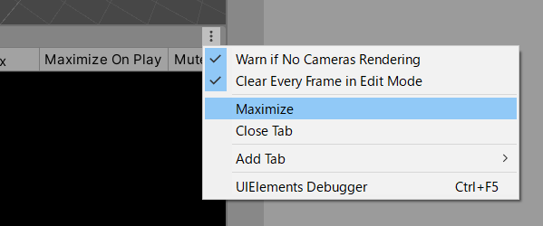

 
### 公転
　次に、月の公転を実装して地球の周りをまわしてみましょう。
先ほどと同じようにMoonを選択してAdd Component→New Script、スクリプト名はOrbiterとします。

Orbiter.cs
```cs
using UnityEngine;

public class Orbiter : MonoBehaviour {

    float radius = 10;  // 回転半径
    float cycle = 27;   // 回転周期 27秒
    float angle = 0;

    void Start () {
        
    }
    
    void Update () {
        angle -= Time.deltaTime * 2 * Mathf.PI / cycle;
        float x = Mathf.Sin(angle) * radius;
        float z = Mathf.Cos(angle) * radius;

        transform.position = new Vector3(x, 0, z);
    }
}
```
 
　ここでも、Time.deltaTimeを使って角度を計算しています。今回は度ではなく、ラジアンなので360の代わりに2πをかけています。使用する関数によって、同じ角度でも度で与えるものとラジアンのものがあるので混乱しないように注意してください。

　計算した角度をSin関数とCos関数に渡して位置を計算します。サイン、コサインは通常、三角関数と呼ばれますが、これは本質的には回転と往復の関数だと考えた方がよいです。自然界で目にするような回転運動や往復運動のほとんどはサインとコサインで表現できるので、ぜひマスターするようにしましょう。ここではサインをx軸、コサインをz軸にしています。この場合は```(0,0,0)```を中心とした円運動になります。

　cycleは回転周期です。月は27日かけて地球の周りを1回転するので27としています。1秒に1回転する回転速度をcycleで割り、回転速度を1/27にしています。

　ここでまた実行確認してみてください。地球が自転して、その周りを月がゆっくり周回しているでしょうか。画面からはみでて見づらいようなら、Main Cameraの位置を少し動かして調整してみてください。


## 発光の表現
　今度は太陽を作って地球が太陽の周りをまわるようにしましょう。
中心に太陽を置けるようにSceneビューで地球と月の位置を少し動かして、HierarchyにSphereを追加してください。Positionは```0,0,0```、Scaleは```4,4,4```、名前はSunにします。

※このサンプルで作成する太陽、地球、月の大きさや距離の比率は実際とは異なります。

次に太陽のマテリアルmatSunを作成します。マテリアルのパラメータを次のように設定してください。  
　Albedo ： R:255, G:0, B:0, A255  
　Metallic： 0  
　Smoothness： 0.5  

　これだけではまだ発光した感じになりません。Emissionにチェックを入れてGlobal IlluminationをRealtimeに、Colorをクリックして次のようにHDR Colorを設定します。  
　R:191, G:60, B:60  
　Intensity： 3  

　こうすることによりColorにHDRの文字が表示され、HDR対応ディスプレイの場合高輝度で表示されます。

　しかし、まだ太陽はただの白い球体に見えます。これから光り輝く恒星にするためには、まだ次節以降の何段階かの手順を必要とします。
 
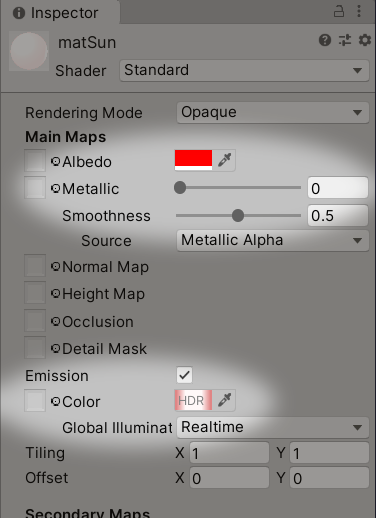

 
### ポイントライトでほかのオブジェクトに影響を与える
　以前、[カメラと光の演出](#カメラと光の演出)の項の冒頭で次のように書きました。
>　シーンに発光する物体がある場合、上記に加えて次の設定をおこないます。  
> * マテリアルのEmission　マテリアル本体の明るさ
> * Point Light　発光物近辺のオブジェクトへの影響
> * Bloom　発光物近辺の空気への影響


　現在、太陽は上記のマテリアルの設定をしただけの状態です。続いてポイントライトを設定していきます。

　HierarchyでSunを選択した状態で、右クリックからLight→Point Lightを選択してください。
 


 
　次にPoint LightのInspectorから、Range:100、Mode:Realtime、Intensity:10、Indirect Multiplier:0に設定します。
これで距離100まで届く、明るい光となりました。Colorはデフォルトの白のままで大丈夫です。
 


　シーンにPoint Lightを置いたので、Directional Lightは不要になります。Hierarchyで選択して削除するか、Inspectorの一番上のチェックボックスを外して無効にします。

　カメラやオブジェクトの位置を調整してGameビューにすべておさまるように調整してください、次のような表示になったでしょうか。太陽の光が月と地球の太陽側の面を照らしだしています。
 
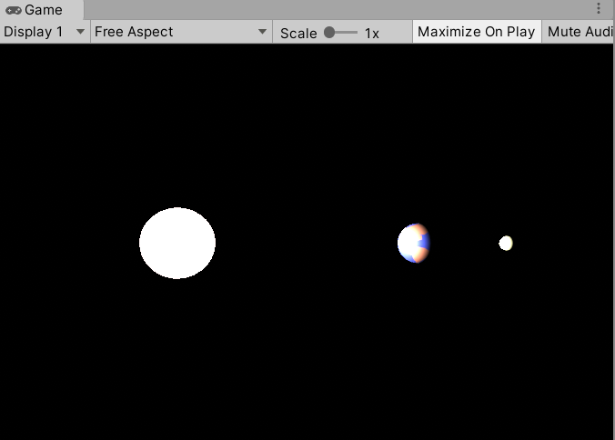

 
### ポストプロセッシング
　太陽の仕上げに、ポストプロセッシングでブルーム効果を付け加えます。Unityのポストプロセッシングは導入するのにちょっと手間がかかりますが、非常に強力な各種視覚効果の適用が可能で、美しい画面を作るのに必須なのでぜひマスターするようにしてください。
 
　Unityのポストプロセスには、比較的新しいPost Processingというパッケージを使用します。以前はPost Processing Stackと呼ばれてアセットストアからインストールしましたが、最新版はパッケージマネージャーからインストールするようになりました。ネットを検索するとまだ旧バージョンの情報が出てくることが多く、バージョン2以降の最新版とは使い方やパラメータも異なるので注意してください。
 
　Post Processingは非常に多機能ですので、ここでは今回必要になる機能と手順だけ説明します。

#### パッケージのインストール
 
　Post Processingはデフォルトの機能ではないのでパッケージをインストールする必要があります。Windowメニュー→Package Managerを選択してパッケージマネージャーを開いてください。

　パッケージマネージャーでPost Processingを選択してInstallボタンを押すとインストールされます。


　インストールしたパッケージは、Packagesフォルダの下にパッケージ別のフォルダを作って格納されます。間違えてインストールしてしまったり、一度インストールしたパッケージが不要になったときはパッケージマネージャーから削除できます。

#### ポストプロセスの設定
 
　Post Processingを利用するには、オブジェクト作成・設定と、メインカメラの設定が必要です。順を追って説明します。


　まず、Hierarchyウィンドウの右クリックメニューからCreate Emptyを選んでシーンに空のオブジェクトを追加します。名前はなんでもかまいませんが、わかりやすいようにPostProcessingとしておきます。


　空オブジェクトのInspectorにあるLayerドロップダウンを開いてAdd Layer...を選択します。


　レイヤ一覧が表示されるので、使用していないレイヤにPostProcessingと入力します。

　視覚効果をかけたいだけなのに設定が少々複雑ですね。UnityのPostProcessingでは、同じシーン上のオブジェクトでも視覚効果をかける対象とかけない対象をレイヤで区別できるるようにしているため、このような手順が必要になっています。


　追加しただけでは選択されないので、再度Layerドロップダウンで、いま追加したレイヤPostProcessingを選択します。


　次にInspectorからAdd Component→Rendering→Post-process Volumeと選択していきます。


　空オブジェクトに追加されたPost-process VolumeコンポーネントのIs Globalにチェックを入れます。

　そしてProfileのNewボタンを押します。この操作でプロファイルがAssets/Scenes/main_ProfilesフォルダにPostProcessing Profileという名前で作成されます。このプロファイルに後で設定する視覚効果のパラメータが書き込まれます。


 

　次にHierarchyウィンドウでMain Cameraを選択して、InspectorからAdd Component→Rendering→Post-process Layerと選択していきます。
 
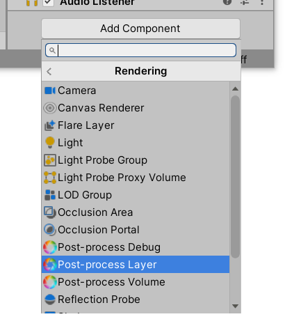


　Post-processing LayerコンポーネントのLayer欄で、先ほど追加したレイヤ名PostProcessingを選択します。


　これでポストプロセスを利用する準備は完了です。

　Hierarchyウィンドウで空オブジェクトPostProcessingを選択してInspectorのPost-process VolumeコンポーネントにあるAdd effect...メニュー→Unityを表示すると、さまざまな設定項目が見えますね。今回はBloomを使っていきます。


Bloomをクリックして項目を開いてパラメータを次のように設定します。

　Intensity：3  
　Threshold ：1.5  
 
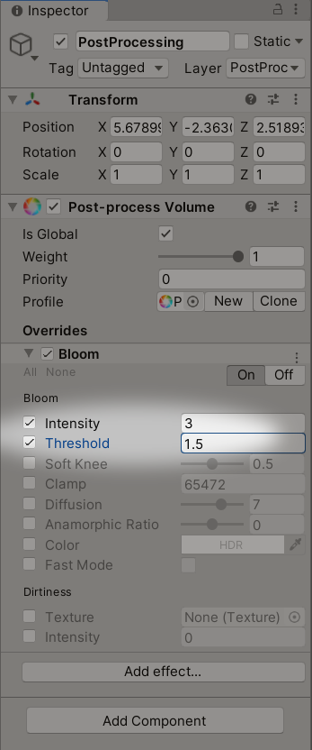

 
　これで太陽光の設定は完了です。ポストプロセスはこの後もさまざまな用途で使用するので少しずつおぼえていってください。
 
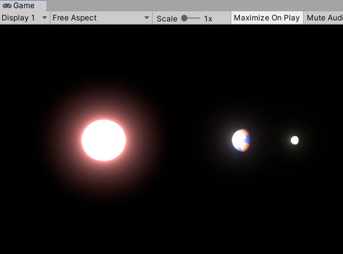

 
### 地球の公転
　いよいよ太陽の周りを地球が回転するようにスクリプトを設定します。先ほど書いたOrbiter.csを改造して地球の公転、月の公転の両方で使えるようにして見ましょう。

Orbiter.cs
```cs
using UnityEngine;

public class Orbiter : MonoBehaviour {

    public GameObject centerObject; // 回転中心のオブジェクト
    public float radius;  // 回転半径
    public float cycle;   // 回転周期

    float angle = 0;

    void Start () {
        
    }
    
    void Update () {
        angle -= Time.deltaTime * 2 * Mathf.PI / cycle;
        float x = Mathf.Sin(angle) * radius;
        float z = Mathf.Cos(angle) * radius;

        Vector3 center = centerObject.transform.position;
        transform.position = center + new Vector3(x, 0, z);
    }
}
```
 
　回転半径と回転周期をpublic変数にしてInspectorで設定できるようにしました。また、centerObjectというpublic変数を用意して回転の中心を指定できるようにしています。つまり月の公転では回転中心は地球、地球の公転では回転中心は太陽となります。地球のように常に移動している回転中心もあるので、Update関数内で毎フレーム中心位置を取得しています。

　HierarchyのEarthにOrbiterスクリプトをドラッグ&ドロップしてアタッチしてください。アタッチできたらInspectorで次のように設定します。

　Center Object：Sun  
　Radius：50  
　Cycle：365

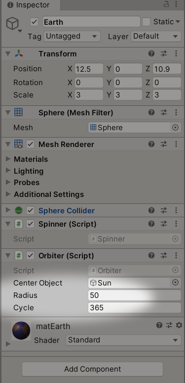

 
　月はすでにOrbiterスクリプトがアタッチされているはずなのでパラメータだけ次のように設定します。

　Center Object：Earth  
　Radius：10  
　Cycle：27

　全体が見やすい位置にMain Cameraを移動して実行してみましょう。Main Cameraの位置はたとえば次の設定がお勧めです。

　Position：20, 10, -10  
　Rotation：10, -50, 0  

　RotationのXを少し上げることで下を見下ろす感じになります。RotationのZを0以外にすると不自然に傾いた絵になるので必ず0にしておきます。

　太陽の周囲を自転しながら地球が回り、さらに地球の周囲を月が回っているでしょうか。
 
## 外観のブラッシュアップ

### 背景の変更
　背景が真っ黒だと少し味気ないので星空に変更しましょう。Windowメニュー→Asset Storeからアセットストアを開いてください。

　アセットストアでSkyboxを検索するとさまざまな背景が見つかります。今回はシンプルな星空のこちらを使用することにします。アセットストアのアセットが目的に合うものか、使いやすいものかを見極めるのはなかなか難しいですが、今回は利用者の評価が高いアセットなので比較的安心して導入できます。

　虫メガネアイコンのSearchをクリック、検索フォームに「Stellar Sky」と入力して検索して見つかったらDownloadボタンをクリックしてダウンロードしてください。
 

 

　ダウンロードが終わったら、項目ひとつひとつに対してインポートするか選択できる画面が出てきます。知識がないとここで必要性を判断するのは難しいので、最初のうちはすべて選択した状態でインポートしてください。余計なものをインポートしてしまっても、シーンに含まれないものはビルド後の実行ファイルには含まれないので問題ありません。

　アセットはプロジェクト内に直接ダウンロードされるのではなく、ディスクの専用の場所にマスターとしてダウンロードされています。それをプロジェクトにインポートするとマスターの複製がプロジェクトフォルダへコピーされるしくみになっています。

　インポートしたアセットは、Assetsフォルダの下にアセット別のフォルダを作って格納されます。もし、あるアセットをインポートした後に設計変更などで不要になった場合、そのフォルダごと削除すればインポートを取り消すことができます。その場合でもダウンロードしたマスターは残っているので、後からまた別のプロジェクトにインポートしたりすることも可能です。


　インポートしたらフォルダの中身をざっくり確認します。Stellar Sky/Skyboxesフォルダの下に512、1024、2048とフォルダがあり、SS_512、SS_1024、SS_2048と3種類のSkyboxが含まれているようです。

　Skyboxの設定はLightingウィンドウとMain Cameraの２ヵ所でおこないます。まず、Windowメニュー→Rendering→Lighting Settingsでウィンドウを開きます。一番上のSkybox Materialに先ほどインポートしたSS_2048をドラッグ&ドロップしてください。Skybox Materialの右側の小さな丸をクリックして一覧から選択することもできます。Sun SourceはNoneとしておきます。

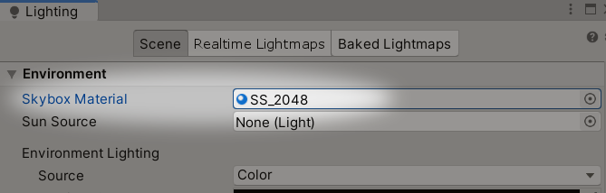

　次にMain CameraのInspectorでCameraコンポーネントのClear FlagsをSkyboxに変更します。これでGameビューにSkyboxが表示されるようになりました。

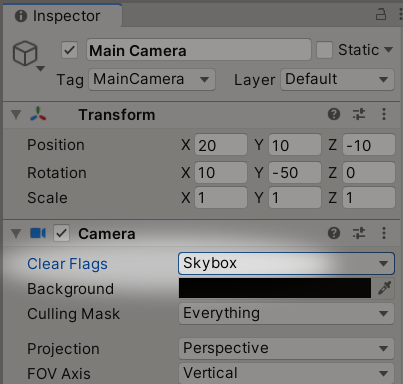

　SceneビューにもSkyboxを表示するには、次の場所にある表示切替ボタンを押してください。


　これでSceneビューとGameビューの両方とも星空の画面になりました。

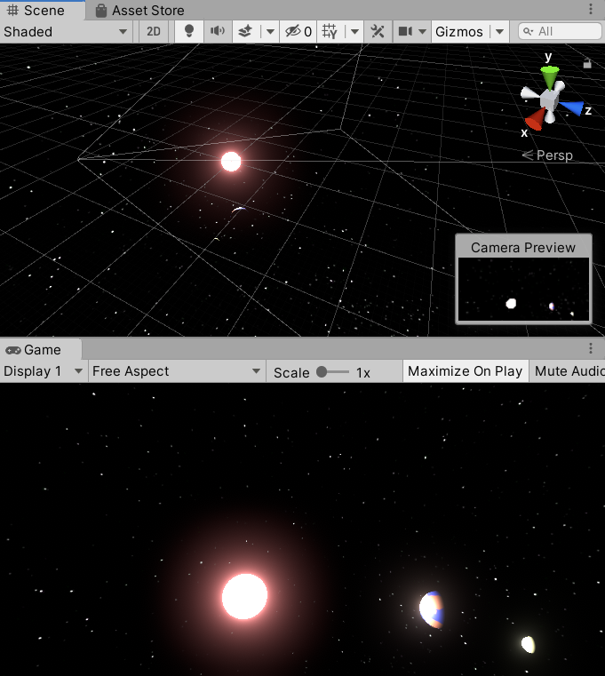

 
### 地球モデルの差し替え

　これまで雑に作ったテクスチャーで地球を表現していましたが、さすがにもうちょっと格好良くしたくなります。クオリティの高い地球のモデルがアセットストアに何種類もあるので、それに差し替えてみましょう。
 


 
　アセットストアで「Planet Earth Free」を検索、ダウンロード、インポートします。
 
　インポートしたら、またざっくり中身を確認。Assets/Planet Earth Free/Prefabsの下にEarthHigh、EarthLow、EarthMediumの３種類のモデルが入っているようです。EarthHighをHierarchyにドラッグ&ドロップして配置します。

　しかしながら、予想に反して巨大な青い球体が表示されました。HierarchyのEarthHighを見ると、子オブジェクトとしてPlanet16128TrisとEarthGlowの2個のオブジェクトがぶら下がっています。このEarthGlowが怪しいので、Inspectorで表示して一番上のチェックを外して非表示にしてしまいましょう。

　巨大な青い球はなくなったものの、まだサイズ的に大きいようです。Planet16128Trisを選択して、Scaleを0.07,0.07,0.07に変更します。このとき、親のEarthHighのScaleではなく、子のPlanet16128TrisのScaleを変更するのがコツです。トップレベルのオブジェクトはスケールが1になっている方が何かと楽です。

　適度なサイズになったらEarthHighを選択してPositionを12,0,10など少し移動させて太陽と重ならないようにしましょう。

　続いてコンポーネントを設定します。EarthHighのInspectorを見るとSpin Freeという自転用コンポーネントが最初からアタッチされています。これは不要なのでコンポーネント右上のメニューからRemove Componentで削除します。


　代わりに自作のSpinnerとOrbiterをドラッグ&ドロップでアタッチします。OrbiterのパラメータをEarthと同じく次のように設定します。

　Center Object： Sun  
　Radius： 50  
　Cycle： 365  

　次にHierarchyでMoonを選択、OrbiterコンポーネントのCenter ObjectをEarthからEarthHighに変更します。最後に、もともとあったEarthはもう不要なのでInspector最上段のチェックボックスを外して非表示にします。これで地球の見た目がぐっと良くなりました。

　実行して、宇宙空間に浮かんだ地球と月が太陽に向いた面を照らされながらゆっくり回転する様子を確認してください。
 


　これでこのシーンは完成です。チュートリアルとしてはここで終了してもよいのですが、せっかくなので次項でこのシーンをもとにして雰囲気の異なる別視点のシーンを作ってみます。

 

## 別視点の演出
　今度はMain Cameraを移動して地球から宇宙を見た風景を作っていきましょう。

　その前に現在のシーンをmainとしてセーブしておきます。

　次にFileメニュー→Save Scene Asで別名保存します。シーン名は「EarthView」とします。
 
　Hierarchy内でMain CameraをドラッグしてEarthHighの子オブジェクトにします。次にカメラの座標を地表に近く、地表と地平線と同じ向きになるように、次のようにパラメータを設定します。

　Position：-1.8, 0, 1.7  
　Rotation： 0, 180, -90

　それから地球の大きさを演出するためにカメラの画角を調整します。Main CameraのCameraコンポーネントにあるField of Viewは初期値が60になっているので、これを40に変更します。
 
　実行してみると、あまりにも高速回転して目が回りそうになってしまいます。少し自転と公転の回転速度を調整した方が良さそうです。Spinner.csとOrbiter.csのUpdate関数のそれぞれ1行目に「 / 50 」を書き加えて、回転速度を1/50に落とします。

Spinner.cs
```cs
    void Update () {
        angle = Time.deltaTime * 360 / 50;
        transform.Rotate(Vector3.up, -angle);
    }
```


Orbiter.cs
```cs
    void Update () {
        angle -= Time.deltaTime * 2 * Mathf.PI / cycle / 50;
        float x = Mathf.Sin(angle) * radius;
        float z = Mathf.Cos(angle) * radius;

        Vector3 center = centerObject.transform.position;
        transform.position = center + new Vector3(x, 0, z);
    }
```
 
　これでチュートリアル「Planet」は終了です。

　この先は、ポストプロセッシングのパラメータを調整して、さらに高品質な絵を追求していくこともできます。空オブジェクトPostProcessingのエフェクトにColor Grading、Vignetteあたりを追加して調整してみてください。Main CameraのPost-process LayerコンポーネントのAnti-aliasingもお勧めです。
 


[チュートリアル２「Penguin」へ進む](3_penguin.html)
