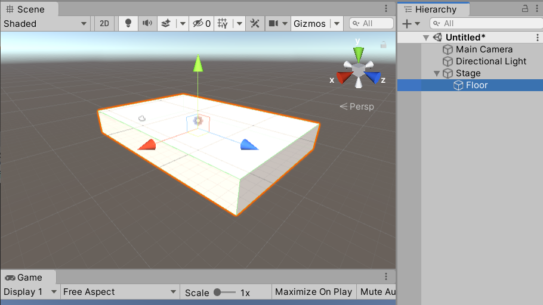
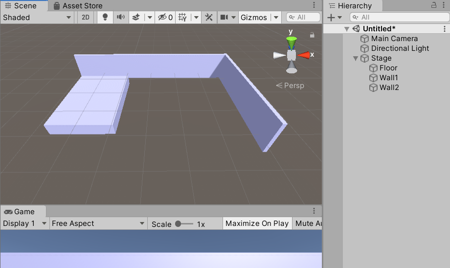
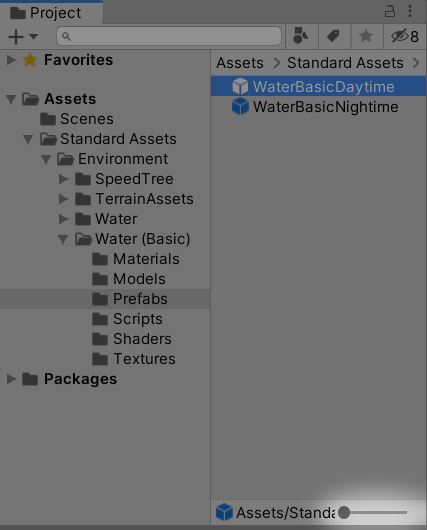
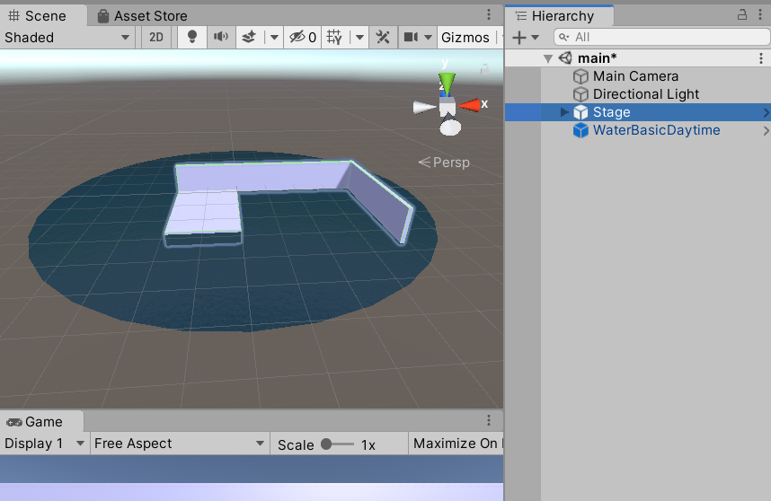
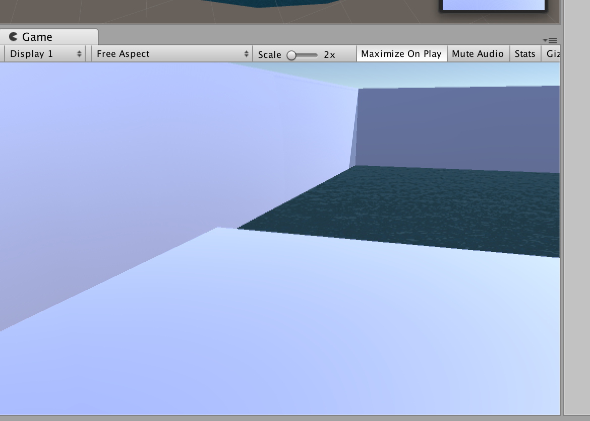
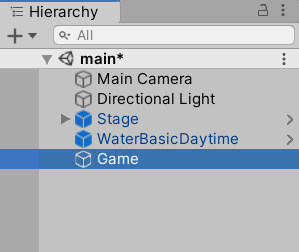
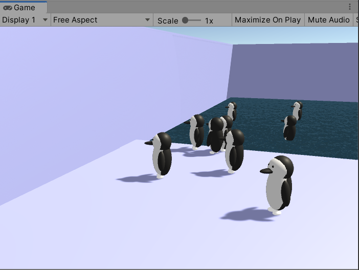
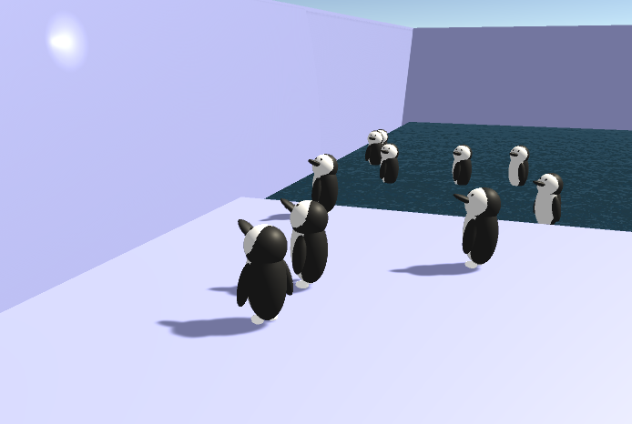

# チュートリアル２「Penguin」

## このチュートリアルについて

　今回のチュートリアルでは光を追いかけるように顔を向けるペンギンを作っていきます。項目としては次のような内容を学んでいきます。

* プレハブの使い方
* 乱数の使い方
* 水の表現
* ターゲットの方向を向く処理
* 三角関数を使ったさまざまな動き

[](https://www.youtube.com/watch?v=AcOAPCGrMmQ)  
https://www.youtube.com/watch?v=AcOAPCGrMmQ


## モデルデザイン用シーン作成
　このテーマではmainとmodelの2つのシーンを作成します。mainは通常のゲーム画面用のシーン、modelはゲーム用のモデルを準備するためのシーンです。実際のゲーム開発でもこのようにシーンを2つ使うことがよくあります。ゲーム画面ではスタートしてすぐにキャラクターや背景のモデルが表示されるとは限らず、しばらく経ってから出現することがあります。出現したモデルも高速で動きまわっていたり、複数同時に現れたりするとモデルの見え方をさまざまな方向からじっくり確認するのには向いていません。そのため、モデルを一覧表示して確認・調整するための専用のシーンを開発用に用意します。また、こうしてシーンを別にすることで、ゲームを実装するプログラマーとモデルを作るデザイナーが分業しやすくなるという大きなメリットもあります。

　Unityの起動画面、あるいはFileメニュー→New Projectから新規プロジェクトを作成します。テンプレートは3Dを選択、プロジェクト名は「Penguin」とします。

### シーンの準備
　最初にmodelシーンを作っていきます。modelシーンには、ステージ（動物園のペンギン舎）のモデルと、ペンギンのモデルひとつだけが置かれます。ここでは、MayaやBlenderといった外部のDCCツール（Digital Content Creation Tool）を使用せず、Unityのプリミティブの組み合わせだけでモデルを作ります。

　File→New Sceneを選んであらたなシーンを作ってください。

　モデルを配置する前に環境光の設定をしておきましょう。Unityの最近のバージョンはデフォルトで環境光が暗く、そのままではモデルが黒っぽく表示されてしまいます。今回は昼間のシーンなので明るくしておく必要があります。

　Windowメニュー→Rendering→Lighting Settingsでダイアログを開きます。

　上段のボタンで「Scene」が選択されていなければ選択してください。

　Environment Lightingで、SourceをColor、Ambient ColorをR:255,B:255,G:255に設定します。
 


　また、次の場所にある表示切替ボタンを押してSceneビューに青空のSkyboxを表示させておきましょう。


### ステージの作成
　Hierarchyで何も選択されていないことを確認し、右クリックメニュー→Create Emptyで空のオブジェクトを作成し、名前を「Stage」と変更します。この下にステージのパーツを子オブジェクトとしてぶら下げていきます。親となるオブジェクトを空ではないキューブや球体にすることもできますが、あとあと必要になる個別の移動やスケール変更といった調整作業を考えると一番親は空オブジェクトにしておくのが楽です。

　次にHierarchyでStageを選択した状態で、右クリックメニュー→3D Object→Cubeを選択してキューブを作成し、名前を「Floor」にします。生成したFloorを選択してInspectorで次のようにパラメータを設定します。

　Position： -10, -3, -10  
　Scale： 20, 4, 30  

　ここでCtrl+S（Macは⌘+S）でシーンをいったんセーブしましょう。シーン名は「model」としてScenesフォルダに保存します。



　同様にStageを選択してCubeをあと2個作ります。名前はWall1、Wall2としてそれぞれ次のパラメータを設定します。

　Wall1  
　Position： 10, 3, 5  
　Scale： 60,10,1  

　Wall2  
　Position： 40, 3, -14  
　Scale： 1,10,40  

　次にこれらのマテリアルを作成します。ProjectウィンドウのAssetsの空き領域を右クリック、メニューから→Create→Materialという操作は前のチュートリアルでおこなった手順と同じです。名前はmatIceとします。このマテリアルは氷をイメージするような水色に設定します。本物の氷というよりも動物園のペンギン舎の壁のような質感にするとよい感じです。

　マテリアル matIce  
　Albedo： R:184,G:190,B:255,A:255  
　Metallic： 0.2  
　Smoothness： 0.6  

　このマテリアルをFloor、Wall1、Wall2にそれぞれドラッグ&ドロップで適用したらステージは完成です。



### ペンギンモデルの作成
　続いてペンギンのモデルを作成していきます。ペンギンのマテリアルは白と黒の２種類、オブジェクトはすべてSphereを変形して組み合わせることで作成します。

　先ほどと同様に新規マテリアルを作成してください。名前はそれぞれmatWhite、matBlackとします。

　matWhite  
　Albedo： R:255,G:255,B:255,A:255  
　Metallic： 0.2  
　Smoothness： 0.2  

　matBlack  
　Albedo： R:28,G:28,B:28,A:255  
　Metallic： 0.9  
　Smoothness： 0.7  

　次にHierarchyで何も選択されていないことを確認し、右クリックメニュー→Create Emptyで空のオブジェクトを作成し、名前を「Penguin」と変更します。

　今度はPenguinを選択して右クリックメニュー→Create Emptyで空のオブジェクトを作成し、名前を「Wrapper」と変更します。
次に、Wrapperを選択して空オブジェクトを2個作成し、名前をそれぞれ「Head」「Body」とします。さらにHeadを選択して空オブジェクトを作成し、名前を「Wrapper」にします。


　このような構造にした理由を説明します。スクリプトを使ってPenguinをmainシーンに配置したとき、自分の意図した向きや大きさとは違っていたりするようなことがあります。以前も少し述べたように最上位のScaleは1であると扱いやすく、また最上位のRotationも0のときに適切な方向を向いている方が便利です。そのためWrapperというノードを一段かませて、配置するサイズや向きのデフォルト値をWrapperに設定する、というテクニックがよく使われます。Headは独立して回転させる予定なのでそこにも向きを調整しやすいようにWrapperを作っておきます。

　今回作るペンギンモデルは、光の方向に追従して回転する顔のパーツと、何も動かない体のパーツから構成されます。そのためそれぞれをグループ化するためにHead、Bodyというノードを用意して、その下に実際のオブジェクトをぶら下げていきます。

　それでは実際にオブジェクトを配置していきます。
まずはHeadの下のWrapperを選択し、右クリックメニュー→3D Object→Sphereとして、Sphereを生成します。同様にBodyを選択してもうひとつSphereを生成します。
それぞれのPositionとScaleなどを次のように設定します。

　Penguin  
　Position： 0, 0, 0  
　Rotation： 0, 180, 0  
　Scale： 1, 1, 1  

　Penguinの下のWrapper  
　Position： 0, 0, 0  
　Scale： 1, 1, 1  

　Head  
　Position： 0, 1.04, 0  
　Scale： 1, 1, 1  

　Headの下のWrapper  
　Position： 0, 0, 0  
　Scale： 1, 1, 1  

　Wrapperの下のSphere  
　Position： 0, 0, 0  
　Scale： 1, 1, 1  

　Body  
　Position： 0, 0, 0  
　Scale： 1, 1, 1  

　Bodyの下のSphere  
　Position： 0, 0.15, 0  
　Scale： 1, 2, 1  


　同様にSphereを生成し、位置とスケールを調整して目やくちばし、羽などを作っていきます。顔のパーツはHeadの下に、体のパーツはBodyの下にぶら下げます。

　生成したSphereにはmatWhiteまたはmatBlackをドラッグ&ドロップで適用していきます。頭や胴体など白黒が途中で切り替わるようなパーツは同じ大きさか少しだけサイズの違う白と黒のパーツをわずかにずらして配置することで作ることができます。

　目や足など同じ大きさのパーツを作るときは、オブジェクトを選択して右クリックメニュー→Dupulicateの操作で複製できるので効率的です。


　こんな感じになればペンギンモデルの完成です。


### モデルのプレハブ化
　作成したモデルを別のシーンから使うためにはプレハブと呼ばれるアセットにする必要があります。方法は簡単で、HierarchyのオブジェクトをProjectウィンドウのAssetsにドラッグ&ドロップするだけです。

　StageとPenguinをプレハブ化してみましょう。


　こんな表示になればプレハブ化できています。


## メインシーン作成
　ここまではモデルデザイン用のシーンで作業していましたが、いよいよメインシーンを作成します。いったんmodelシーンをセーブして、FileメニューからNew Sceneを選択してください。

　このシーンでも、先ほどと同じように環境光を調整します。Windowメニュー→Rendering→Lighting Settings  Environment Lightingを開いて次のように設定してください。

　Source: Color  
　Ambient Color: R:255,B:255,G:255  

　設定できたら、シーンを「main」の名前でセーブします。

### ステージの配置
　メインシーンにステージを配置します。先ほど作ったStageプレハブがAssetsにあるのでそれをHierarchyにドラッグ&ドロップします。StageのInspectorを見てPositionが 0, 0, 0になっていなければすべてゼロにしてください。

### 水面の配置
　次はステージに水を張りましょう。

　アセットストアでStandard Assetsを検索してください。Unity公式の標準アセットが見つかります。以前はUnity本体にバンドルされていた標準アセット集で、いまはアセットストアで提供するようになったようです。
 


　この標準アセットを使う場合に注意点がひとつあります。アセットが少し古いために最新版のUnityですべてのアセットをインポートするとエラーが出てしまうことがあります。ここではEnvironmentのみを選択してインポートするようにしてください。


　標準アセットには水の表現用にいくつかのアセットが用意されています。今回は一番シンプルなWaterBasicDaytimeを使用します。Assets/Standard Assets/Environment/Water（Basic）/Prefabs/にWaterBasicDaytimeというアセットを探してください。アイコンが大きくてファイル名が見づらい場合は、ウィンドウ下部のスライダーで変更できます。



　WaterBasicDaytimeをHierarchyにドラッグ&ドロップ。パラメータは次のよう調整してください。

　Position： 0, -1.67, 0  
　Scale： 60, 1, 60  

　円形の水面が配置されました。



### 構図の調整
　メインカメラの位置と角度を調整して構図を決めましょう。左側の方からステージを見るように次のようにMain Cameraのパラメータを設定します。

　Position： -24, 5.5, -8  
　Rotation： 15, 70, 0  

　前回のチュートリアルでも書きましたが、こういった斜めからの構図の場合、RotationのZは必ず0にして水平を正しくとるようにしましょう。

　画角も調整しましょう。Field of Viewの値を40にします。


　Gameビューが次のような絵になったら構図の調整は完了です。




### ペンギンの生成
　次にペンギンをランダムな位置に生成するスクリプトを作ります。ペンギンを生成するスクリプトはどこにアタッチするとよいでしょうか。これはわりと悩ましい問題です。Main Cameraにアタッチすることも多いですが、数が増えてくるとごちゃごちゃしてきます。複数カメラを配置するようなシーンのような場合、ちょっと見つけにくくなったりすることもあります。

　自分の場合、Gameという名前の空のオブジェクトをシーンにひとつ置いて、こういったゲームの環境を整えたり、ゲーム全体に関わる処理をするスクリプトを全部そこへアタッチするようにしています。



　それでは、Gameオブジェクトを選択し、InspectorのAdd Component→New Scriptを選んで新規スクリプトを作成しましょう。スクリプト名はPenguinGeneratorとします。

PenguinGenerator.cs
```cs
using UnityEngine;

public class PenguinGenerator : MonoBehaviour {

    public GameObject penguinPrefab;    // ペンギンのプレハブ

    void Start () {
        // ゲーム開始時に10羽生成する
        for (int i = 0; i < 10; i++)
        {
            float x = Random.Range(-14f, 20f);      // 横方向の位置
            float y = 0;    // 高さ方向の位置
            if (x > 0)      // ペンギンが画面右側のプールにいる場合少し位置を下げる
            {
                y = -1;
            }
            float z = Random.Range(-10f, 2f);       // 奥行き方向の位置
            float angle = Random.Range(-45f, 45f);  // 体の向き

            // プレハブをもとにインスタンス化
            GameObject penguin = Instantiate(penguinPrefab, new Vector3(x, y, z), Quaternion.identity);

            // ランダムな向きになるよう角度をつける
            penguin.transform.eulerAngles = new Vector3(0, angle, 0);
        }
    }    
}
```

　public変数でペンギンのプレハブをInspectorから設定できるようにしています。AssetsにあるPenguinプレハブをInspectorのPenguin Prefabにドラッグ&ドロップしてください。

　このスクリプトでは、for文のループを10回まわしてゲーム開始時にペンギンを10羽生成しています。
ペンギンの出現位置は変数xと変数zで指定していますが、これはRandom.Range関数を使って乱数を生成しているので毎回ランダムな位置に出現します。

　ここでちょっと型について解説します。C#言語では、数値の型によって書き方が異なります。10と書くとint、10.0はdouble、10fはfloatとなります。Unityでは、Position、Scale、Rotationなどの値はfloatで計算されるので、それらに設定する数字の後にはfをつけるのが正しい書き方です。通常はintの書き方で書いても自動的に変換されますが、doubleの書き方をするとエラーになります。スクリプト自体は一見正しいように見えるので注意してください。最初のうちはdoubleの型を使うことはほとんどないので、「小数点を含む数値には必ず末尾にfをつける」と覚えておきましょう。

　Random.Range関数を使うときは型を意識する必要があります。なぜなら```Random.Range(intの数値, intの数値)```と書いたときと```Random.Range(floatの数値, floatの数値)```と書いたときでは挙動が異なるからです。たとえば```Random.Range(0, 5)```の場合、0、1、2、3、4のいずれかの整数が返ります。しかし```Random.Range(0f, 5f)```の場合、0.1fや2.71f、4.89f……といった無数にある実数の値がひとつ返ります。つまり、実数の乱数がほしい場合は、明示的に引数にfをつけて実数であることを示す必要があるということです。

```cs
// プレハブをもとにインスタンス化
GameObject penguin = Instantiate(penguinPrefab, new Vector3(x, 0, z), Quaternion.identity);
```
　ここでプレハブをもとにペンギンの実体を生成しています。プレハブはあくまでも設計図のようなもので、それをもとにシーンへ実体を生成することをインスタンス化と呼びます。ひとつの設計図から大量の製品を作り出すような様子をイメージしてください。

　スタートボタンで実行すると次のようにペンギンが生成されます。乱数で生成しているので出現位置は毎回異なります。




### ターゲットオブジェクトの配置
　ペンギンが目で追いかける光を配置します。Hierarchyで何も選択されていないことを確認し、右クリックメニュー→Light→Point Lightで空のオブジェクトを作成し、名前を「Target」と変更します。

　Inspectorからパラメータを設定。壁際ギリギリのところに配置します。  
　Position： 0, 4, 4

　小さく強い光にします。  
　Range： 1  
　Intensity： 3  


## ターゲットの方向を向く処理
　ペンギンにスクリプトを追加して光の方向を向くようにします。いったんmainシーンをセーブした後に、modelシーンを開いてください。

　HIerarchyのペンギンモデルのHeadを選択してAdd Component→New Scriptとしてスクリプトを追加。名前はHeadRotatorとします。

HeadRotator.cs
```cs
using UnityEngine;

public class HeadRotator : MonoBehaviour {

    GameObject target;

    void Start () {
        target = GameObject.Find("/Target");        
    }
    
    void Update () {
        transform.LookAt(target.transform);
    }
}
```

　Start関数では、HierarchyのTargetというオブジェクトを探してtargetという変数に割り当てています。Update関数では毎フレームtargetの位置を取得してLookAt関数でその方向を向くようにしています。

### プレハブの更新

　さて、シーン上のPenguinオブジェクトにスクリプトを追加しましたが、それだけではAssetsのPenguinプレハブにはまだ追加されておらず相違がある状態になっています。mainシーンで参照しているのはAssetsのプレハブの方ですので、こちらにも変更を反映する必要があります。

　HierarchyのPenguinを選択し、Inspectorの右上３段目にあるOverridesメニューを開いてApply Allボタンを押します。これで変更がプレハブの方にも反映されてほかのシーンからも参照できます。


 
　ここでmodelシーンをセーブしてmainシーンに戻ってください。

 
　mainシーンでスタートボタンを押すと、出現したペンギンがそれぞれ光の方向を向いていたら成功です。今のところ光は動かないので、ペンギンも動かずに一点を見つめているだけです。

 
## さまざまな動きのアルゴリズム
　最後にスクリプトを追加して光を動かします。何種類か異なるアルゴリズムのスクリプトを書いて動きの違いを見てみましょう。

### シンプルな往復
　まずはシンプルな往復運動で実装してみます。HierarchyでTargetを選択してAdd Component→New Scriptでスクリプトを追加します。スクリプト名はLightMoverとします。

LightMover.cs
```cs
using UnityEngine;

public class LightMover : MonoBehaviour
{
    bool flag = true;
    float x = 0;

    void Update()
    {
        if (flag)
            x += Time.deltaTime * 30;
        else
            x -= Time.deltaTime * 30;

        if (Mathf.Abs(x) > 12)
            flag = !flag;

        transform.position = new Vector3(
            x,
            transform.position.y,
            transform.position.z
        );
    }
}
```

　このスクリプトでは、flagで移動方向を制御しています。flagがtrueのときは右へ移動、falseのときは左へ移動します。移動速度はTime.deltatime * 30、位置xの絶対値をとって位置が12以上あるいは-12以下となったらflagを反転させて移動方向を逆向きにしています。

　往復運動は一応できましたが、移動方向の変化が急激すぎてペンギンが首を痛めそうです。

 
### スムーズな往復
　次はペンギンの首の健康に考慮して、スムーズな速度変化の往復運動を考えてみます。こういった現実の物体のようななめらかな動きにすることをイージングと呼び、さまざまな手法が考案されています。今回はシンプルな三角関数で実装することにします。LightMover.csを次のように書き換えて実行してみてください。

LightMover.cs
```cs
using UnityEngine;

public class LightMover : MonoBehaviour {

    float angle = 0;
        
    void Update () {
        angle += Time.deltaTime * 2;

        transform.position = new Vector3(
            Mathf.Sin(angle) * 12,
            transform.position.y,
            transform.position.z
        );
    }
}
```

 
　Sin関数を使うと回転運動を真横から見た動きになります。つまり動き自体は往復ですが、往復の端に近付くほど速度が遅くなるためスムーズな動きになりました。

 
### 楕円形の移動
　Sin関数の横方向の往復に加えて、同じタイミングで縦方向の動きも加えると楕円形の運動になります。

LightMover.cs
```cs
using UnityEngine;

public class LightMover : MonoBehaviour
{

    float angle = 0;

    void Update()
    {
        angle += Time.deltaTime * 2;

        transform.position = new Vector3(
            Mathf.Sin(angle) * 12,
            Mathf.Cos(angle) * 2 + 4,
            transform.position.z
        );
    }
}
```


　x方向はSin関数を使いy方向はCos関数を使うことで、xがゼロのときはyが最大、xが最大のときはyがゼロになる動きをします。つまりこれは円の運動です。x方向の移動距離を最大12、y方向の移動距離を最大2とすることで楕円にしています。y方向は往復の中心位置を4の高さにして壁の少し上の方で回転するようにしました。

 
### ８の字の移動
　前項のスクリプトを少し変えるだけで８の字の移動になります。

LightMover.cs
```cs
using UnityEngine;

public class LightMover : MonoBehaviour
{

    float angle = 0;

    void Update()
    {
        angle += Time.deltaTime * 2;

        transform.position = new Vector3(
            Mathf.Sin(angle) * 12,
            Mathf.Sin(angle * 2) * 2 + 4,
            transform.position.z
        );
    }
}
```

　違いは```Cos(angle)```を```Sin(angle * 2)```にしただけです。y方向の往復を、x方向の往復の２倍のタイミングでおこなうことにより、８の字の動きをするようになりました。angleにかける値や、Sin、Cosどちらを使うかによってこれ以外にも複雑な動きをさせることができます。ぜひ試してみてください。

 
　これでチュートリアル「Penguin」は終了です。短いプログラムでも工夫次第でゲーム的なおもしろい動きを演出できることが実感できたでしょうか。

 



[チュートリアル３「TrenchFighter」へ進む](4_trenchfighter.html)
