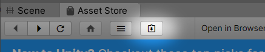
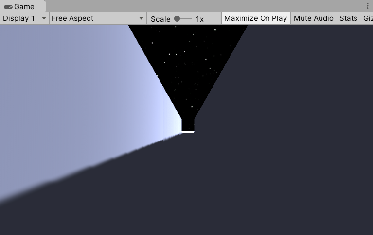
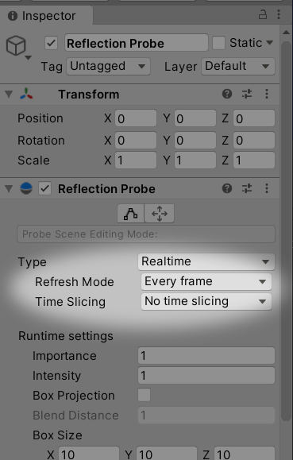
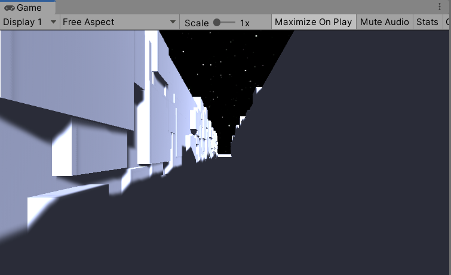
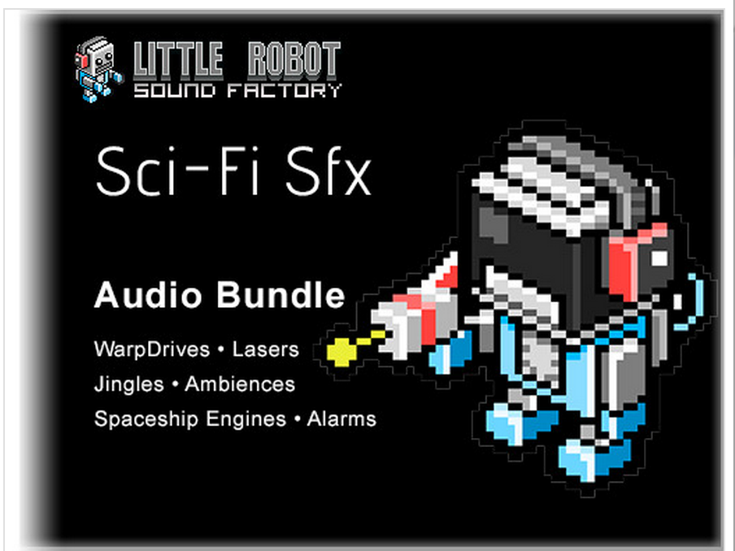
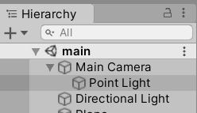

# チュートリアル３「TrenchFighter」

## このチュートリアルについて

　今回のチュートリアルでは、敵機をよけながら高速で狭い隙間を進んでいくゲーム風の画面を作っていきます。項目としては次のような内容を学んでいきます。

* プロシージャルなステージ生成
* アセットの再利用方法
* 簡単なサウンドの使い方
* 物理演算を使わない衝突判定
* 入力の処理
* ポストプロセッシングで絵作りその２ 

[](https://www.youtube.com/watch?v=0RFQhiBr58c)  
https://www.youtube.com/watch?v=0RFQhiBr58c


## メインシーンの作成

　このテーマも、前回同様にmainとmodelの2つのシーンを用意します。敵機のような常に動き回るものをじっくり確認しながら調整するためにmodelシーンを利用します。

　Unityの起動画面、あるいはFileメニュー→New Projectから新規プロジェクトを作成します。テンプレートは3D、プロジェクト名は「TrenchFighter」にします。今回のステージはmainシーンに直接作っていきます。Hierarchyで何も選択していない状態で、右クリックメニューから平面（Plane）1個と直方体（Cube）2個を作成してください。

Plane  
　Position： 0, 0, 0  
　Scale： 50, 1, 50  

Cube  
　Positon： -11.7, 0, 0  
　Scale： 20, 8, 80  

Cube  
　Positon： 11.7, 0, 0  
　Scale： 20, 8, 80  

 


 
　ここでFileメニュー→Save As...を選択していったんセーブします。シーン名は「main」としてScenesフォルダに保存します。

 
　次はマテリアルです。これまで同様、ProjectウィンドウのAssetsの空き領域を右クリック、メニューから→Create→Materialの操作ですね。名前はmatStageとします。建築物の外壁のようなイメージで、少しくすんだ水色にしておきます。

　マテリアル matStage  
　Albedo： R:182,G:194,B:244,A:255  
　Metallic： 0  
　Smoothness： 0  

　このマテリアルを先ほどのPlaneとCubeにそれぞれドラッグ&ドロップで適用します。

 
### アセットのインポート
　背景は星空にしたいので、チュートリアル１で使った「Stellar Sky」をここでも利用します。ダウンロードしたオリジナルのアセットは専用のフォルダに保存されているので、再度ダウンロードする必要はありません。次の手順でインポートしてください。

* Windowメニュー→Asset Storeを選択してAsset Storeウィンドウを開く
* Asset Storeウィンドウの右上が人型のアイコンになっていたらクリックしてログイン
* 右上がそれ以外のアイコンであればログインは不要です

 


 
* 次に四角形に下向き矢印のついたアイコンのMy Assetsを選択します。

 



 
ここには、過去に入手したアセットが一覧表示されます。Stellar Skyが見つかったら「Import」ボタンを押してプロジェクトにインポートします。インポート対象はデフォルトの全選択のままでよいです。

 


 
　Skyboxの設定も以前おこなったとおりです。Assets/Stellar Sky/の下にSS_512、SS_1024、SS_2048と3種類のSkyboxが含まれていることを確認します。Windowメニュー→Rendering→Lighting Settingsでウィンドウを開いて、一番上のSkybox MaterialにSS_2048をドラッグ&ドロップします。Skybox Materiaの右側の小さな丸をクリックして一覧から選択することもできます。Sun SourceはNoneとしておきます。


　次にMain CameraのInspectorでCameraコンポーネントのClear FlagsがSkyboxになっていること、Sceneビューの各種表示ボタンが押されていることを確認します。


　Sceneビュー、Gameビューの背景が星空になりました。


 
### ライトの設定
　ここからライトを設定していきます。カメラの右後ろから投影して映画のように陰影を強調した雰囲気を作ります。影が濃く出すぎるときは環境光で強調します。また色味もデフォルトで黄色味がかっているので調整します。

HierarchyのDirectional Lightを選択して、Inspectorから次のパラメータを変更します。

　Rotation: 20, -20, 45  

　Color: R:255 G:255 B:255 A:255  
　Intensity： 1.5


　次に環境光です。Windowメニュー→Rendering→Lighting Settingsで再度ウィンドウを開き、Environment Lightingを次のように設定します。

　Source： Color  
　Ambient Color： R:75 G:75 B:75  

 



 
　これでmainシーンはほぼ完成です。Ctrl+S（Macは⌘+S）でシーンをセーブしましょう。

## モデルシーンの作成
　次にmodelシーンでモデルを作成していきます。今回はステージに現れるでこぼこした構造物と敵機をモデルとして作成します。

　先ほどmainシーンのライトを設定しました。モデル調整時の色味もmainシーンと同じようにした方がわかりやすいので設定をそのまま流用します。mainシーンを開いている状態でFileメニュー→Scene As...を選択してセーブします。シーン名は「model」とします。タイトルバーにシーン名modelが表示されていることを確認してください。

 

  

 
　mainシーン用に配置したPlaneとCubeは不要なので削除します。Hierarchyで選択、右クリックメニューからDeleteです。

 
### 構造物モデルの作成
　ステージに配置する構造物は非常にシンプルです。HierarchyにCubeをひとつ生成して、「Structure」と名前を付けます。設定値は次のとおりです。

　Position： 0, 0, 0  
　Scale： 1, 1, 1  

　次にStructureに、先ほど作成したmatStageをドラッグ&ドロップします。その後Structureをプレハブ化するためにProjectウィンドウのAssetsにドラッグ&ドロップします。

　これで構造物のモデルは完成です。この立方体をランダムに生成することで複雑な壁面を表現します。今回作成するプログラムでは、自機が高速で進んでいるように見えますが、実は自機もmainシーンの溝も動いていません。ランダムに生成した構造物モデルが前から後ろに移動することで自分が前進しているように見せています。無限に続くステージをUnityのシーンで作成するのは困難です。そこで見える部分の構造物だけ生成して奥から手前に動かし続け、メインカメラを通過したらまた前方から現れるようにして長いステージを表現しています。

 


 
### 敵機モデルの作成
　次に敵機モデルを作成します。何も選択されていない状態のHierarchyで右クリックからCreate Empty、名前を「Enemy」とします。パラメータは次のとおり。

　Position： 2, 0, 0  
　Scale： 1, 1, 1

　Enemyの下にもう１階層Create Emptyして名前を「Wrapper」とします。さらにその下にSphere1個、Cube2個、Cylinder1個を配置します。

　Sphere  
　Position: 0, 0, 0  
　Rotation: 0, 0, 0  
　Scale: 0.3, 0.3, 0.3  

　Cube  
　Position: -0.25, 0, 0  
　Rotation: 45, 0, 0  
　Scale: 0.05, 0.6, 0.6  

　Cube  
　Position: 0.25, 0, 0  
　Rotation: 45, 0, 0  
　Scale: 0.05, 0.6, 0.6  

　Cylinder  
　Position: 0, 0, 0  
　Rotation: 0, 0, 90  
　Scale: 0.1, 0.25, 0.1  


　今回の宇宙船のデザインに前後はありませんが、独自のデザインの場合、前方はZ軸がマイナスの方向を向くようにします。Gameビューには宇宙船の正面が見えている状態になります。（後から方向が間違っていることに気付いたときや、サイズを変えたくなった場合は、wrapperのRotationやScaleを変更することで調整できます）

 


 
　次に敵機のマテリアルを作成します。敵機は周りの物体を反射する鏡面素材にします。ProjectウィンドウのAssetsで右クリック→Create→Materialを選択してマテリアルを作成してください。名前はmatEnemyにします。

　Albedo：R:255 G:255 B:255 A:255  
　Metallic： 0.95  
　Smoothness： 0.6

　マテリアルができたら、敵機の各部にドラッグ&ドロップして適用します。
 
　鏡面素材の場合、もう一工夫必要です。反射する物体を検知するためにReflection ProbeというオブジェクトをEnemyに追加します。
　Wrapperを右クリックしてLight→Reflection Probeを選択して、Inspectorで次のように設定してください。

　Type: Realtime  
　Refresh Mode: Every frame  
　Time Slicing: No time slicing  




　反射が確認しやすいように床も配置しましょう。何も選択されていない状態のHierarchyで右クリックからPlaneを作成します。

　Position: 0, -2, 0  
　Scale: 1, 1, 1  

　スタートボタンを押すと、周囲のオブジェクトを検知してマテリアルが鏡面反射したでしょうか。今回の反射の設定は動き続ける物体のため、毎フレーム周囲を検知するようにしています。これはPCによっては高負荷になってしまう可能性もあります。重くて動きが悪い場合はTypeやRefresh Modeの設定を調整したり、場合によっては反射させるのをやめたりといったことを検討してください。


 
　スタートボタンを再度押して実行終了してから、EnemyをProjectウィンドウのAssetsにドラッグ&ドロップしてプレハブ化します。

 
### 移動スクリプトの作成
　次に構造物モデルと敵機モデルを移動するプログラムを作成します。先ほども説明したように前方に現れて後方に移動し、見えなくなったらまた前方から現れる、という処理です。

　Structureオブジェクトを選択し、InspectorのAdd Component→New Scriptを選んで新規スクリプトを作成しましょう。スクリプト名はStructureMoverとします。

StructureMover.cs
```cs
using UnityEngine;

public class StructureMover : MonoBehaviour {

    float speed = 30;

    void Update () {
        float z = Time.deltaTime * speed;

        transform.position -= new Vector3(0, 0, z);
        if (transform.position.z < -10)
        {
            transform.position += new Vector3(0, 0, 50);
        }
    }
}
```

　速度のパラメータを30とし、Time.deltaTimeと掛けることでPC性能にかかわらず一定の速度で動くようにしています。x、y座標は変化せず、z座標だけをマイナスしていくことで奥から手前へ移動させています。z座標が-10になったら、もう後方で見えなくなっているので、z座標に50を足して再び前方から現れるようにしています。


　敵機のスクリプトも同じような構造です。Enemyを選択し、InspectorのAdd Component→New Script。スクリプト名はEnemyMoverとします。

 
EnemyMover.cs
```cs
using UnityEngine;

public class EnemyMover : MonoBehaviour {

    float speed;

    void Start () {
        Init();    
    }
    
    void Update () {
        float z = Time.deltaTime * speed;

        transform.position -= new Vector3(0, 0, z);
        if (transform.position.z < -30)
        {
            Init();
        }        
    }

    void Init() {
        speed = Random.Range(25f, 35f);
        float x = Random.Range(-1f, 1f);
        float y = Random.Range(0.5f, 5f);
        float z = 50;
        transform.position = new Vector3(x, y, z);
    }
}
```

 
　構造物の移動処理と似ているのがわかりますね。今度は出現位置と速度が都度ランダムになっています。一番初めのStart時と、後ろに消えて再出現するときに乱数で位置と速度を決めるため、共通関数Init()を用意して呼ぶようにしています。

　構造物はz座標が-10になったら前方へ移動して再び出現するようにしていましたが、敵機の場合はあとでエンジン音を追加する関係上、通過直後の-10ではなく-30にしています。距離が離れて音が聞こえなくなるくらいになってから再出現するように調整してあります。


　スクリプトを追加したので、Hierarchyとプレハブとの相違が発生しています。変更をプレハブに反映するため、HierarchyのStructureを選択してInspectorからOverrides→Apply Allを押してください。Enemyも同様にApplyします。

 
　ここでCtrl+S（Macは⌘+S）を押してmodelシーンをセーブしましょう。

 
## 動的なステージ生成
### 構造物の生成処理
　それでは作成したモデルを生成する処理を書いていきましょう。mainシーンを開いてください。


　ゲーム全体の処理のスクリプトを配置するために、前回も作成した空のオブジェクトを配置しましょう。HierarchyでCreate Emptyして名前を「Game」とします。

 
　次にGameを選択し、InspectorのAdd Component→New Script。スクリプト名はStructureGeneratorとします。

StructureGenerator.cs
```cs
using UnityEngine;

public class StructureGenerator : MonoBehaviour {

    public GameObject structurePrefab;

    void Start () {
        for (int i = 0; i < 100; i++)
        {
            float size;
            Vector3 pos;
            GameObject obj;

            // 右側
            size = Random.Range(0.3f, 2f);
            pos = new Vector3(
                Random.Range(-0.1f, 0.1f) + 2f,
                Random.Range(0f, 4f),
                Random.Range(-10f, 50f)
            );
            obj = Instantiate(structurePrefab, pos, Quaternion.identity);
            obj.transform.localScale = new Vector3(1f, size, size);

            // 左側
            size = Random.Range(0.3f, 2f);
            pos = new Vector3(
                Random.Range(-0.1f, 0.1f) - 2f,
                Random.Range(0f, 4f),
                Random.Range(-10f, 50f)
            );
            obj = Instantiate(structurePrefab, pos, Quaternion.identity);
            obj.transform.localScale = new Vector3(1f, size, size);

            // 下側
            size = Random.Range(1f, 2f);
            pos = new Vector3(
                Random.Range(-1f, 1f),
                0,
                Random.Range(-10f, 50f)
            );
            obj = Instantiate(structurePrefab, pos, Quaternion.identity);
            obj.transform.localScale = new Vector3(size, 0.1f, size);
        }
    }
}
```

 
　ちょっと長いですが、頑張って読んでみてください。やっていることは単純です。右側、左側、下側にそれぞれランダムなサイズ、ランダムな位置に構造物モデルを生成しています。Instantiate関数は、以前も出てきましたがプレハブをシーン上に実体化する処理です。ひとつのプレハブからたくさんのコピーを作成するときに良く使われます。今回は全体が100回ループのfor文で囲まれているので、右、左、下それぞれ100個ずつの構造物オブジェクトが生成されます。このように、あらかじめシーンに配置するのではなく、動的にプログラムでステージを生成することをプロシージャルな手法と呼びます。うまく生成すると複雑で広大な地形を一気に作ることができるので、最近のゲーム制作でもよく使用される手法です。

　なお、実行時にフレームレートが十分出ないときは、この100の数字を下げることで処理を軽くできます。画面上のオブジェクトの数と処理速度はトレードオフなので仕上げの段階になったらこういったところを調整するようにしてみてください。


　このスクリプトは、public変数で構造物のプレハブをInspectorから設定できるようにしてあります。AssetsにあるStructureプレハブをInspectorのStructurePrefabにドラッグ&ドロップしてから実行してください。

 



 
### 敵機生成処理
　敵機生成処理も同様に、Gameを選択し、InspectorのAdd Component→New Scriptです。スクリプト名はEnemyGeneratorとします。

 
EnemyGenerator.cs
```cs
using UnityEngine;

public class EnemyGenerator : MonoBehaviour {

    public GameObject enemyPrefab;

    void Start () {
        for (int i = 0; i < 3; i++)
        {
            GameObject enemy = Instantiate(enemyPrefab, Vector3.zero, Quaternion.identity);
        }
    }    
}
```

　敵機生成は非常にシンプルです。出現位置は敵機自身がランダムに決める処理を先ほど書きましたし、サイズも一定でよいので、単純にInstantiateするだけです。for文で3回ループしているので敵機は3機出現します。
　これも、AssetsにあるEnemyプレハブをInspectorのEnemyPrefabにドラッグ&ドロップしてから実行してください。

 


 
## サウンドの追加
　次はサウンドを追加してみましょう。Asset StoreでそれっぽいフリーSE集を探してみます。

 



 
　Asset StoreでSci-Fi Sfxを検索してダウンロード、インポートしてください。

　インポートしたら、中身を確認しましょう。サウンドファイルを選択してInspector下部の波形表示の右上に再生ボタンがあるのでひとつひとつ聞いてます。  
　（なんか、どれも思ってたんと違う感じ……）  
　まあ、でも妥協して使っていきましょう。イメージぴったりのアセットが見つかることはめったにないので、とりあえず手元にある素材でなんとかするのも腕の見せ所です。

　今回導入したいSEは、自機のエンジン音、敵機のエンジン音、自機と敵機の衝突音の３種類です。まずは自機のエンジン音から設定していきます。

 
### 自機のエンジン音
　自機のエンジン音はAssets/Sci-Fi-Sfx/Wav/Ambience_Space_00が良さそうです。ゴーという低い小さな音が鳴り続ける感じです。Sci-Fi SfxにはMP3のサウンドファイルとWavのサウンドファイルが両方収録されているようです。注意点としては、環境音のように無限ループで鳴らす音の場合MP3は避けた方がよいです。MP3は構造上先頭に空白が入ってしまうため、ループするときにブツッと音が途切れてしまいます。Wavの場合は空白が入らないのでこちらを使うようにしましょう。

　自機のサウンドはMain Cameraにアタッチします。音を受けるAudio ListenerコンポーネントがMain Cameraにアタッチされているため、音の方向や移動の設定をしない音はそれと同じ場所に配置します。

　Main CameraのInspectorからAdd Component→Audio Sourceを選択します。次にAudio SourceコンポーネントのAudioClipにAmbience_Space_00をドラッグ&ドロップします。次のようにパラメータを設定してください。

　Play On Awake：有効  
　Loop：有効  
　Spatial Blend：0 （2D）   

 

  

 
### 敵機のエンジン音
　敵機のエンジン音はAssets/Sci-Fi-Sfx/Wav/SpaceShip_Engine_Large_Loop_00を使います。今度は自機と敵機の位置や速度によって音が変化する3Dオーディオを活用しましょう。AssetsのEnemyプレハブを選択してAdd Component→Audio Sourceとします。次にAudio SourceコンポーネントのAudioClipにSpaceShip_Engine_Large_Loop_00をドラッグ&ドロップします。パラメータは次のようにします。

　Play On Awake：有効  
　Loop：有効  
　Spatial Blend：1 （3D）

　3D Sound Setting  
　Doppler Level： 3  
　Min Distance： 2  
　Max Distance： 6  

　Doppler Levelを設定することでドップラー効果をシミュレートできます。近付いてくるときは高い音、離れていくときは低い音になり、すれ違うときにビューウンという音程変化が生まれます。またMin Distance、Max Distanceを小さめにすることで近付いたときに急に音が大きくなり、スピード感が強調されます。

 

  

 
### 衝突音
　後で使うときのために衝突音も準備しておきましょう。衝突音はAssets/Sci-Fi-Sfx/Wav/Laser/Laser_02を使います。このサウンドファイルは音量が大きいので少し調整した方が良さそうです。先ほどと同様に、AssetsのEnemyプレハブを選択してAdd Component→Audio Sourceを選択します。次にAudio SourceコンポーネントのAudioClipにLaser_02をドラッグ&ドロップします。パラメータは次のようにします。

　Play On Awake： 無効  
　Loop： 無効  
　Volume： 0.16  
　Spatial Blend： 0 （2D）   

　Play On Awakeを無効にしたので、そのままでは音は鳴りません。後でスクリプトに鳴らす処理を追加します。

　それでは実行してみましょう。低い自機のエンジン音と、敵機とすれ違うときの音が聞こえたでしょうか。

 
## 簡易的な衝突判定
　Unityでは物理演算を使って衝突判定をするのが定番ですが、物理演算はかなり癖があって初心者にはあまりお勧めできないと思っています。たとえば今回のような高速で移動するオブジェクトは、物理演算だと意図せずすり抜けてしまう現象が起こりやすく、それらに対処するため直感的とはいえないいくつものバッドノウハウを必要とします。そのため、最初はシンプルな衝突判定を実装し、その後本格的なゲームを作成するときに物理演算を学んでいくような順番がよいと考えています。
　

　今回実装する衝突判定処理は、敵機と自機（メインカメラ）との距離を毎フレーム計算し、一定距離より近付いたら衝突したと判断するものです。

AssetsのEnemyプレハブを選択し、InspectorのAdd Component→New Script。スクリプト名はHitDetectorとします。

HitDetector.cs
```cs
using UnityEngine;

public class HitDetector : MonoBehaviour {

    GameObject target;
    AudioSource se;

    void Start () {
        target = Camera.main.gameObject;
        se = GetComponents<AudioSource>()[1];
    }
    
    void Update () {
        if (Vector3.Distance(target.transform.position, transform.position) < 0.5f)
        {
            se.Play();
        }
    }
}
```


　targetが自機（メインカメラ）です。これはCamera.main.gameObjectとして取得できます。また、衝突音seはGetComponents<AudioSource>()としてEnemyにアタッチされている複数のAudio Sourceを取得しています。先ほど敵機のエンジン音と衝突音の2個のAudio Sourceをアタッチしました。そのため、[0]を指定するとエンジン音、[1]を指定すると衝突音が得られます。

　Update関数の中で、自機とEnemyの距離Distanceを取得して、距離が0.5未満の場合、衝突音を鳴らしています。

 
## 入力の処理
　敵機と衝突するようになったので、キー操作で自機を移動できるようにしましょう。基本的にはGetKeyでキーの状態を読んで、positionを移動するだけです。

　HierarchyのMain Cameraを選択し、Add Component→New Script。スクリプト名はCameraMoverとします。

CameraMover.cs
```cs
using UnityEngine;

public class CameraMover : MonoBehaviour {
    void Update () {
        float delta = Time.deltaTime * 1.5f;

        if (Input.GetKey(KeyCode.LeftArrow))
        {
            if (transform.position.x > -1)
            {
                transform.position -= new Vector3(delta, 0f, 0f);
            }
        }
        if (Input.GetKey(KeyCode.RightArrow))
        {
            if (transform.position.x < 1)
            {
                transform.position += new Vector3(delta, 0f, 0f);
            }
        }
        if (Input.GetKey(KeyCode.DownArrow))
        {
            if (transform.position.y > 0.5f)
            {
                transform.position -= new Vector3(0f, delta, 0f);
            }
        }
        if (Input.GetKey(KeyCode.UpArrow))
        {
            if (transform.position.y < 5)
            {
                transform.position += new Vector3(0f, delta, 0f);
            }
        }
    }
}
```

　キーコードを見て矢印キーなら上下左右に動かしているだけです。それぞれリミットに達したらそれ以上は動かないよう制限しています。Unityのキー状態取得関数にはGetKeyのほかにもGetKeyDown、GetKeyUpなどがあります。GetKeyは押している間ずっとtrueが返りますが、GetKeyDown、GetKeyUpはキーのダウン、アップの1回だけtrueが返ります。今回のようにキーを押している間移動し続けるような場合はGetKeyが適しています。

## 外観のブラッシュアップ
　ゲームの構造は以上で完成です。最後にまたポストプロセスを使って画面をリアルにしていきましょう。

### ポストプロセスの追加

　Post Processingの導入手順はチュートリアル１でも詳しく説明しています。

* Windowメニュー→Package Managerを選び、Post Processingをインストール
* Hierarchyウィンドウの右クリックメニューからCreate Empty、名前はPostProcessingとする
* 空オブジェクトのInspectorにあるLayerドロップダウンを開いてAdd Layer...を選択、PostProcessingレイヤを追加
* 空オブジェクトのInspectorにあるLayerドロップダウンを開いてPostProcessingレイヤを選択
* 空オブジェクトのInspectorからAdd Component→Rendering→Post-process Volumeを追加
* Post-process VolumeコンポーネントのIs Globalにチェックを入れる
* Post-process VolumeコンポーネントのProfileのNewボタンを押す
* HierarchyウィンドウでMain Cameraを選択、InspectorからAdd Component→Rendering→Post-process Layerを追加
* Post-processing LayerコンポーネントのLayer欄で、先ほど追加したレイヤ名PostProcessingを選択
* 空オブジェクトのPost-processing VolumeコンポーネントにあるAdd effect...メニュー→Unityから各種エフェクトを追加

 
#### Ambient Occlusion
　壁と床の交わるような角を暗くする効果です。古びた雰囲気やリアルな質感が簡単に出せるのでお勧めです。

　Intensity：0.35  
　ほかのパラメータはデフォルト。


#### Motion Blur
　今回の構造物や敵機のような高速で移動するものは、よく見るとフレーム間でパラパラと細かくジャンプしているように見えます。モーションブラーは、動いている物体に微妙にブラーをかけることでパラパラした感じをなくして、滑らかに高速で動いている効果を出すことができます。

　パラメータは全部デフォルト。


#### Vignette
　Instagram等でよく見るような画面の外周付近を暗くする効果です。レトロな雰囲気が出るほか、今回のような高速移動時にスピードで視界が狭くなる効果にも使えます。

　Intensity：0.43  
　Smoothness：0.43  
　ほかのパラメータはデフォルト。

 
　次にフォグ（霧）の効果をかけます。距離的に遠いものを暗くするエフェクトで、視認性を悪くする効果だけでなく、遠近感やスケール感の演出に使えます。ライトの設定にあります。

　Windowメニュー→Lighting→Settingsでウィンドウを開いて、下の方にあるOther Settingsで設定します。

　Fog：有効  
　Color：R:15 G:15 B:20  
　Mode：Exponential  
　Density：0.1  


### ヘッドライトの追加

　最後にまたライトを調整します。ポストプロセスのVignetteやフォグで少し画面が暗くなったので、Main Cameraの下にPoint lightを置いてヘッドライトで近距離の敵や壁を照らす効果を追加します。



　Position: 0, 0, 2

　Light  
　Range: 10  
　Intensity: 0.5


　おつかれさまでした。これでチュートリアル「TrenchFighter」は終了です。
 


 

